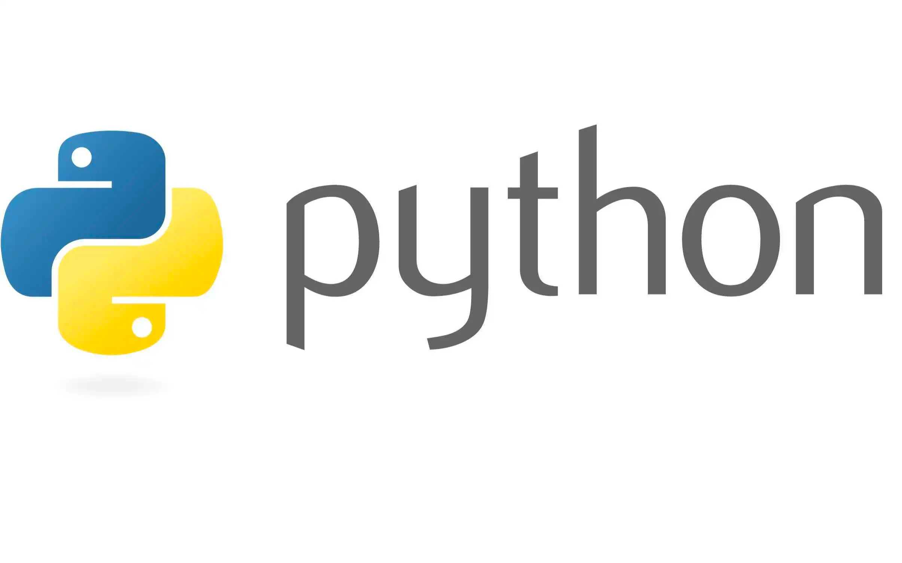

## Python 高级编程笔记
> 学习 Python 进阶知识, 更有利于理解实现原理, 编写出更加高性能且"优美"的代码

%系统全面的学习Python高级知识和并发编程

### 核心技术点
1.  面向对象
2.  魔法方法
3.  元类
4.  生成器
5.  多线程
6.  协程

### 详细知识点
1.  Python中一切皆对象
2.  魔法函数
3.  深入类和对象
4.  自定义序列类
5.  深入Python的set和dict
6.  对象引用, 可变性和垃圾回收
7.  元类编程
8.  迭代器和生成器
9.  Python socket编程
10. 多线程, 多进程和线程池编程
11. 协程和异步io
12. asyncio 并发编程
13. 总结
